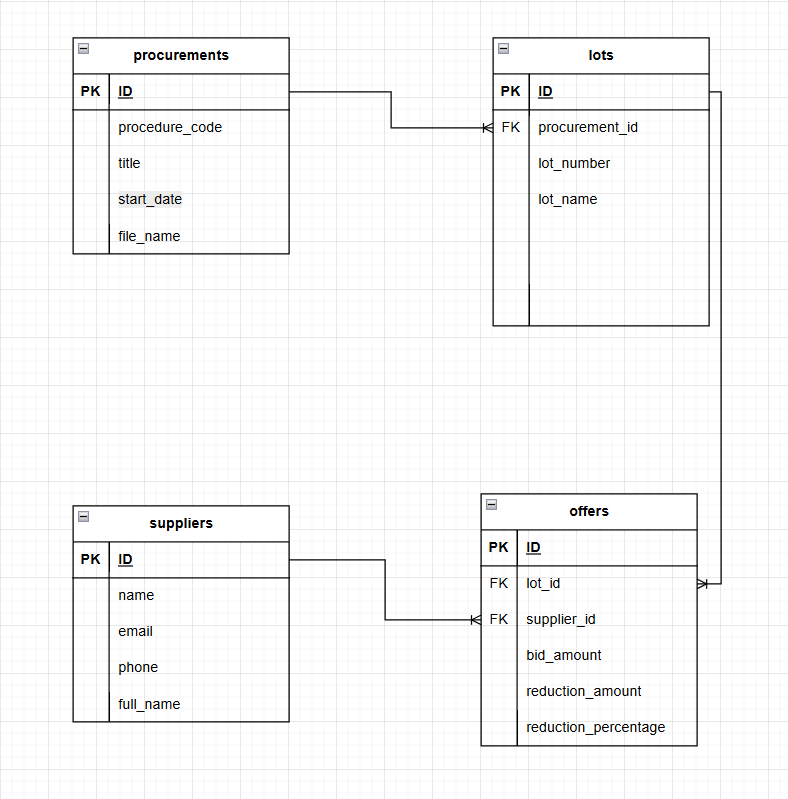

# Tender Parser

Парсер Excel-файлов закупочных процедур с загрузкой в PostgreSQL.

## Быстрый старт

### Требования
- Python 3.9+
- PostgreSQL 14+
- Excel файлы (.xlsx)

### Установка
```bash
git clone https://github.com/username/tender_parser.git
cd tender_parser
python -m venv venv
source venv/bin/activate  
pip install -r requirements.txt
pip install -e .
```
## Схема базы данных
